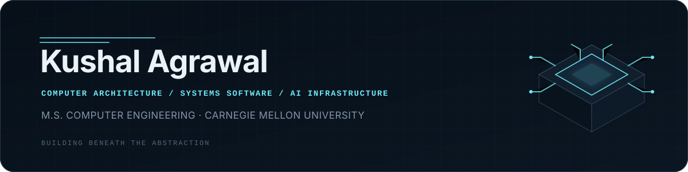
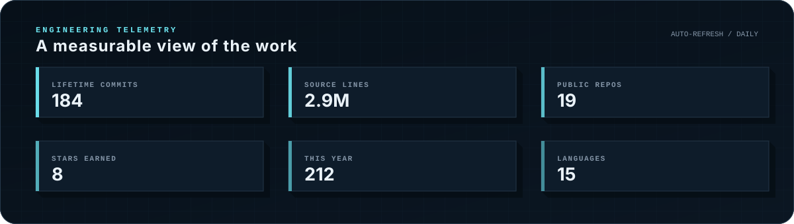
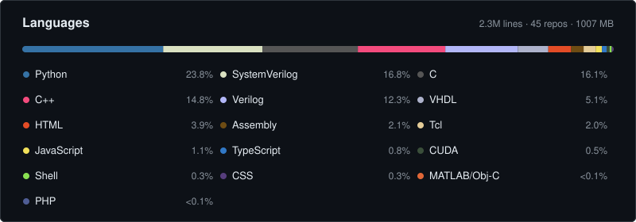
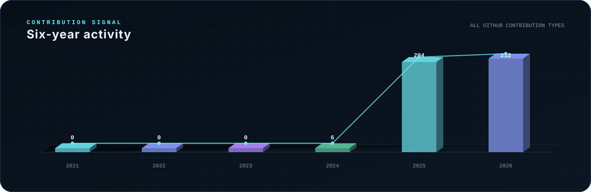

  

  <a href="https://kushalagrawal.net/">Portfolio</a>
  &nbsp;&nbsp;·&nbsp;&nbsp;
  <a href="https://www.linkedin.com/in/kushalagrawal0/">LinkedIn</a>
  &nbsp;&nbsp;·&nbsp;&nbsp;
  

Hi I'm Kushal Agrawal! A first-year Computer Engineering master's student at Carnegie Mellon University. My interests center on the intersection of computer architecture and systems software, especially in designing efficient platforms for AI and high-performance computing. I am driven by the idea of building the underlying tools and infrastructure that allow future technologies to scale.

 

  

  

  

  COMPUTER ARCHITECTURE&nbsp;&nbsp;·&nbsp;&nbsp;SYSTEMS SOFTWARE&nbsp;&nbsp;·&nbsp;&nbsp;FPGA / RTL&nbsp;&nbsp;·&nbsp;&nbsp;AI INFRASTRUCTURE&nbsp;&nbsp;·&nbsp;&nbsp;HPC

<!--
Dashboard definitions:
- Lifetime commits = commits counted by GitHub's contributions API.
- Source lines = nonblank, non-comment source lines in indexed owned repositories.
- Language shares = source-line shares after exclusions in profile-config.json.
-->
